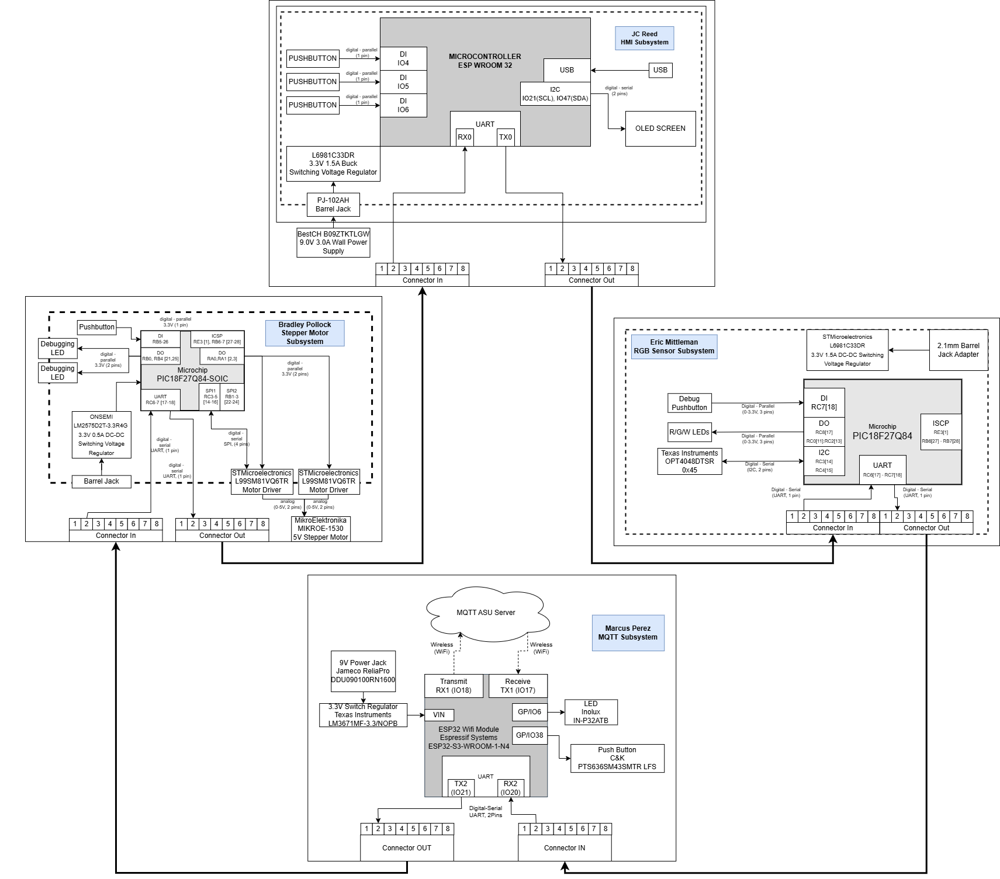
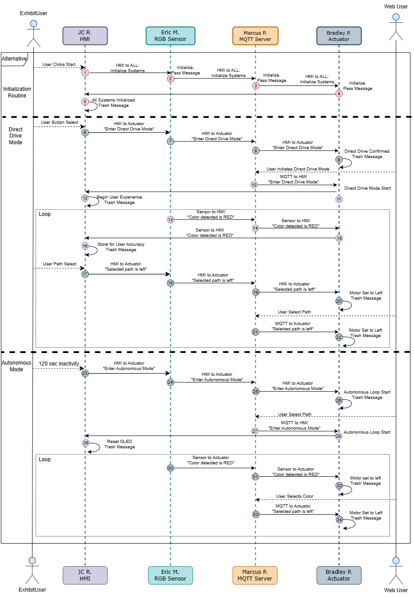

The following diagrams outline the hardware and message structure for this project. 

# **Team Block Diagram**

# **Team Sequence Diagram**

Sequence Diagram SVG Download: [link](docs/static/Images/Team-201_UML_Diagram.drawio.svg)
# **Team Message Structure**

*Table 1: Message Types* 

|Message Type   byte 1-2  (uint16_t) | Description|
|-------------------|---------------|
|0                  | Status Code   |
|1                  | Drive Mode    |
|2                  | Sensor Data   |
|3                  | Path Selection|

__________________________________________________________________________

*Table 2: Status Message*  

| Byte 1-2 (uint16_t) | Byte 3 (uint8_t) |
|---------------------|------------------|
| 0x00                | status           |

Status Message Key:  

| Byte 3 (uint8_t) | Description |
|------------------|-------------|
| 0x00             | Offline     |
| 0x01             | Online      |
| 0x02             | Waiting     |
| 0x03             | Error       |

__________________________________________________________________________

*Table 3: Drive Mode*

| Byte 1-2 (uint16_t) | Byte 3 (uint8_t) |
|---------------------|------------------|
| 0x01                | Mode             |

Drive Mode Key:  

| Byte 3 (uint8_t) | Description |
|------------------|-------------|
| 0x00             | Automatic   |
| 0x01             | Direct Drive|

__________________________________________________________________________

*Table 4: Sensor Data*

| Byte 1-2 (uint16_t) | Byte 3 (uint8_t) |
|---------------------|------------------|
| 0x02                | color            |

Sensor Data Key:

| Byte 3 (uint8_t) | Description |
|------------------|-------------|
| 0x00             | Orange         |
| 0x01             | Blue       |
| 0x02             | Pink        |

__________________________________________________________________________

*Table 5: Path Selection*

| Byte 1-2 (uint16_t) | Byte 3 (uint8_t) |
|---------------------|------------------|
| 0x03                | path             |

Path Selection Key:

| Byte 3 (uint8_t) | Description |
|------------------|-------------|
| 0x00             | left        |
| 0x01             | center      |
| 0x02             | right       |