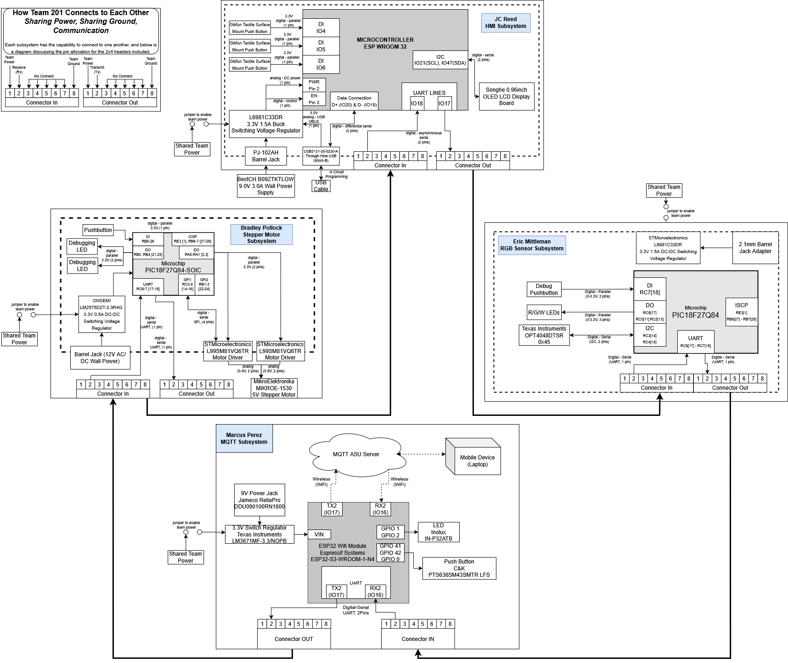
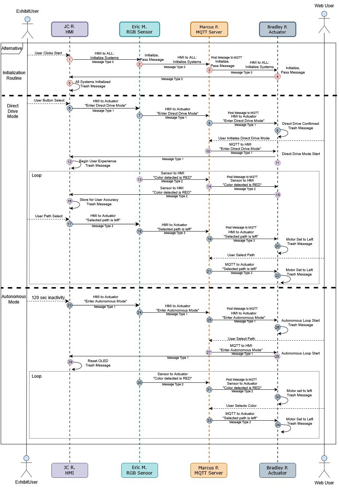

The following diagrams outline the hardware and message structure for Team 201’s project. Team 201’s Block Diagram highlights the various components each team member is using within their individual subsystem as well as the general flow of communication. Following the block diagram is the team sequence diagram. Sequence diagrams are extremely useful in visualizing how messages interact between subsystems. The team discusses the many scenarios/use-cases within this diagram — further details on how each message is structured in their respective situation is the last section of this page. For a comprehensive evaluation of said structure, see Table 4: Message Verification. 

## **Team Block Diagram**

### **Decision Making Process & Meeting Requirments**
The Block diagram decided on by Team 201 reflected greatly the concepts necessitated by the class project requirements, such as shared team power and communication structure. As each team member designed their subsystem, changes were gradually implemented to better optimize the communication between boards and overall functionality of the system. At this point in the project, it was important to consider the order of the daisy chain layout. The block diagram was structured in a circular manner to show the first member connecting to the following members in a clockwise fashion. This was important to visually showcase the communication as well. Functionally, the block diagram strictly adhered to the project requirements, as communication was built around the predefined class protocol. All major components chosen **(voltage regulators, microcontrollers, power supplies)** satisfy project requirements — Both required microcontrollers are featured throughout the block diagram, while each member maintains a 3.3V switching regulator of their choice. Furthermore, each member is clearly responsible for the four required subsystems.

## **Team Sequence Diagram**

Sequence Diagram SVG Download: [link](static/Images/Team 201 - UML Sequence Diagram.drawio.svg)

### **Functionality & Meeting Requirements**
The function of the communication sequence developed by Team 201 within the scope of the EGR 314 project structure greatly enhances user experience and satisfies user needs. The interactive Museum exhibit designed by the team utilizes a daisy-chain style message structure, described above in the communication sequence diagram. As depicted, the device satisfies the user’s need for an interactive, yet simple user interface *(the user can only send three possible messages, all of the same type: selected paths, i.e. message type 3).* The device also accounts for the need for a colorful, eye-catching device by functioning autonomously during idle periods between users.

As a product of this project’s origin in an Engineering 314 class, additional criteria were also considered when developing the message structure. Though the message structure depicted above displays a particular order in which team members pass messages along, each member is capable of passing messages that aren’t intended for them *(see messages 7 and 8 in the UML diagram above as an example of this feature).* This fact means that each team member’s board can connect to the others in any order, provided that all boards are connected linearly to the others in a daisy-chain configuration. Indeed, this feature was employed frequently during testing to enable system functionality in the absence of various team members, and to ensure that each team member’s board indeed passes messages not meant for them.

Another functionality pictured above is bidirectional MQTT communication over a wireless connection. A critical function in testing and demonstration was the ability to craft messages on an external device (i.e. a laptop computer) and send them from MQTT as a broadcast. This advantageous feature also allows communication testing and overall device function even in the absence of various team members; if for some reason the sensor is disabled, messages of type 2 (sensor data) can be sent over the MQTT server and device function continues as normal. The MQTT features are not limited to only sending messages; the server is also used as a **“scope”** into the messages sent by other team members. As pictured above, each message passed through MQTT is visually ‘published’, allowing the team to ensure proper message handling and verify communication. When combined with the aforementioned daisy-chain reconfigurability, this functionality becomes invaluable.

## **Team Message Structure**
UART messages are sent from team member to team member in an 8-byte format. Each byte has a specifix role, outlined in Table 1 below. 

*Table 1: Message Byte Structure*

|**Byte Number**|0-1|2|3|4|5|6-7|
|---|---|---|---|---|---|---|
|**Byte Contents**|AZ|Sender ID|Receiver ID|Message Type|Message Data|YB|

The message prefix AZ and suffix YB function as a message start/stop indicator, allowing team members to efficiently filter out extraneous noise on UART lines as well as anticipate a prescribed message format. Sender and Reciever IDs (see table 2) are used to identify to which team member a message is intended, as well as provide a marker of who sent the message. This is advantageous given the daisy-chain layout of Team 201's project, as messages will be sent from member to member until they are terminated by their recipient or their sender, depending on message type (see Table 3 for Message Type IDs and their respective data).

*Table 2: Team IDs*

| Team member (Role) | Team ID |
|---|---|
|JC  (HMI)| H |
|Eric  (Sensor)|S|
|Marcus  (MQTT Server)|M|
|Bradley  (Actuator)|A|
|Broadcast  (sends to all members)|X|

*Table 3: Message Types and Data Structure*

| Message Type (UINT8_t) | Message Data info (UINT8_t) |
|---|---|
|**Type 0: Initialization**  **Message Type ID:** 0x00|**Message Contents:** 0x00 *Enable all systems*|
|**Type 1: Drive Mode**  **Message Type ID:** 0x01|**Message Contents:** 0x00 *Autonomous Function* 0x01 *User-Controlled Function*|
|**Type 2: Sensor Data**  **Message Type ID:** 0x02|**Message Contents:** 0x00 *Sensor detects Orange* 0x01 *Sensor detects Blue* 0x02 *Sensor detects Pink*|
|**Type 3: Path Selection**  **Message Type ID:** 0x03|**Message Contents:** 0x00 *Orient motor Left* 0x01 *Orient motor Right* 0x02 *Orient motor Right*|

## **Message Verification Table**
The following table (see Table 4) can be used to visualize all message styles to be sent during device function, and how each team member handles various message types. The order in which team members are featured (from left to right) also mirrors the flow of data throughout the device, namely, messages sent from Eric to JC must first pass through Marcus' board, then Bradley's, before finally reaching JC. This functionality is a result of the project's daisy-chain layout.

*Table 4: Message Verification Table*

|Message Type  *(Message Type ID)*|JC  Role: HMI ID:H|Eric  Role: Color Sensor ID:S|Marcus Role: MQTT Server (Web Service) ID:M|Bradley Role: Motor actuation ID:M|
|---|---|---|---|---|
|Initialize Routine *(0x00)*|S (Initialize Systems)|R (Status Light Toggles)|R (Status Light Toggles)|R (Status Light Toggles) (mqtt topic: /EGR314/TEAM201/SUB)|
|Drive Mode Change *(0x01)*|S (Alter Drive Mode to Autonomous or User-Controlled)|-|R (mqtt topic: /EGR314/TEAM201/SUB) S (mqtt topic: /EGR314/TEAM201/PUB)|R (Alter motor positioning algorith based on Drive mode sent)|
|Sensor data *(0x02)*|R (Display Element from detected category)|S (Detected color is _)|R (mqtt topic: /EGR314/TEAM201/SUB) S (mqtt topic: /EGR314/TEAM201/PUB)|R (Alter motor position based on detected color)|
|User path select *(0x03)*|S (Selected path is _)|-|R (mqtt topic: /EGR314/TEAM201/SUB) S (mqtt topic: /EGR314/TEAM201/PUB)|R (Alter motor position based on selected path)|

### **Decision Making & Meeting Requirements**
The team adopted the classroom’s predefined message structure to ensure reliable UART-based communication between all subsystems. This structure consisted of a fixed sequence: **PREFIX (AZ), SENDER ID, RECEIVER ID, MESSAGE TYPE, DATA, SUFFIX (YB).** This served as the common protocol among the four subsystems, through the daisy chain. While the overall structure was given, our team made a deliberate decision to use single-byte fields for both the message type and data. This minimized parsing complexity and reduced the message length, which was especially important for speed and ease of implementation. Team 201 established four distinct message types: 
- 0x00: Status (Initialized)
- 0x01: Drive Mode (Automatic/Manual)
- 0x02: Sensor Color (Orange, Blue, Green)
- 0x03: Path Selection (Left, Center, Right)

Each message type was paired with a set of acceptable data values, which ensured that every subsystem could validate and process only the message relevant to it. By standardizing both the structure and the content of it, the team avoided miscommunication and kept communication between microcontrollers relatively smooth.

## **Changes in Software Design**
The team made several changes to their software design, with the majority of changes focusing on the team’s communication structure. The following changes are deemed most significant:
- **Number of Message Types:** Team 201 originally designed a message structure composed of several various data types, including additional error state messages and user accuracy information. As the project progressed Team 201 discovered that the majority of errors encountered dealt more with communication itself rather than on faulty data or board function, and as such converted the various error messages into one initialization routine that verified both message receipt and passing capabilities with a single broadcast message. This simple function was heavily utilized during the final phases of testing and demonstration, as it serves to indicate function, communication with other boards, and power. With each team member designing their software individually, it quickly became redundant to send messages related to user accuracy as each team member either did not utilize the information or was already calculating it on-board. As such the HMI, the only device used to display user accuracy, no longer sends that information to the remaining team boards. 
- **Byte Structure:** As discussed previously, message types and data are listed as a singular byte of information. *This was originally not the case* — Team 201 initially designed ‘message type’ to hold a space for two bytes, however this was a waste of space and speed during communication. 
- **MQTT App vs Scope Functionality:** Team 201 intended to create an entire user-facing application to function over MQTT after encouragement from external review. Over the course of the project, however, the scope of the team’s desired MQTT functionality shifted from a user-centered to product-development focus, leading to the current “scope” function of the MQTT board *(see “Communication Functionality and User/Project Needs” above).* While a user-facing application would have been an appropriate and entertaining option, lack of customizable applications and time constraints necessitated a shift in scope that better served the development of the final element sorter.
- **Case Structure:** During software proposals, the PIC microcontroller's original program had the capability to parse an entire message and make a decision based on the content within said message. This software structure was extremely helpful for getting communication to function, but did not perform actions the way the team intended. While the structure of parsing was kept intact, a decision was made to move away from ‘if else’ statements and migrate to ‘switch case’ statements. This was useful to organize code, as well as quickly make a decision as the message was coming in, not after it was formatted together.
- **Interrupts vs delays:** As the team progressed through the class, the focus was shifted to programming using interrupts, rather than delays. Team 201 moved to a more interrupt-driven approach due to the fact that it is more efficient on saving time to complete various tasks, as well as simultaneous completion of said tasks. This approach was implemented in both the PIC and ESP32 microcontrollers (enable interrupts in C, and asyncio in micropython).
