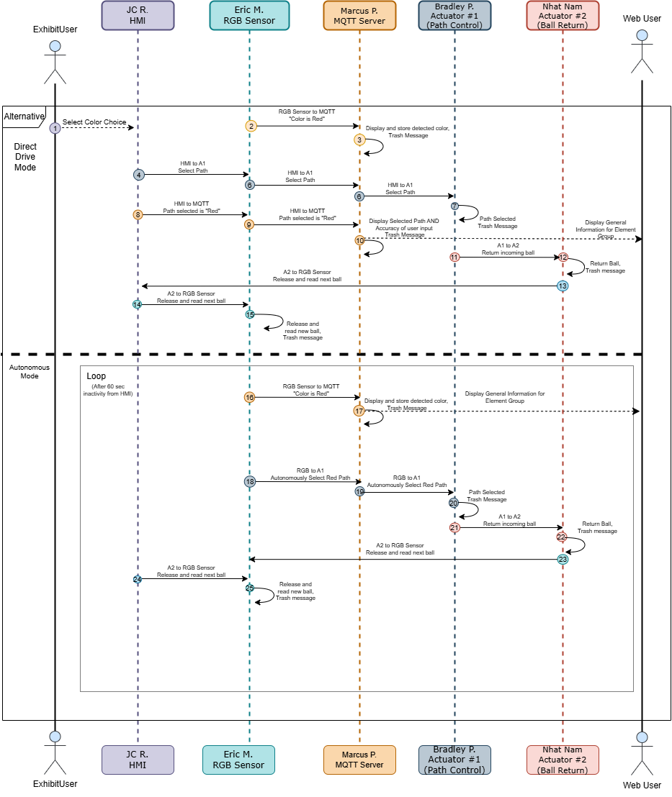

# **Team Block Diagram**

# **Team Sequence Diagram**

# **Team Message Structure**

*Table 1: Message Types*
| Message Type | Description |
|---|---|
| 1 | set actuator x param y |
| 2 | sensor data x |
| 3 | set stepper motor state param x |
| 4 | User input button x pushed |
| 5 | subsystem z error code |
| 6 | subsystem z status code |

*Table 2: Message Type definitions*

**Message Type 1: set actuator x param y**
| Byte 1-2 (uint16_t) | Byte 3 (uint8_t) | Byte 4-5 (uint16_t) |
|----|----|----|
| 0x01 (uint16_t) | X (uint8_t) | Y (uint16_t) |

**Message Type 2: sensor data RGB**
| Byte 1-2 (uint16_t) | Byte 3 (uint8_t) | Byte 4 (uint8_t) | Byte 5 (uint8_t) |
|----|----|----|----|
| 0x02 (uint16_t) | R (uint8_t) | G (uint8_t) | B (uint8_t) |

**Message Type 3: set stepper motor state param x**
| Byte 1-2 (uint16_t) | Byte 3 (uint8_t) |
|----|----|
| 0x03 (uint16_t) | X (uint8_t) |

**Message Type 4: User input button x pushed**
| Byte 1-2 (uint16_t) | Byte 3 (uint8) |
|----|----|
| 0x04 (uint16_t) | X (uint8_t) |

**Message Type 5: subsystem z error code**
| Byte 1-2 (uint16_t) | Byte 3 (uint8_t) | Byte 4 (uint8_t) |
|----|----|----|
| 0x05 (uint16_t) | Z (uint8_t) | X (uint8_t) |

**Message Type 6: subsystem z status code**
| Byte 1-2 (uint16_t) | Byte 3 (uint8_t) | Byte 4 (uint8_t) |
|----|----|----|
| 0x06 (uint16_t) | X (uint8_t) | Y (uint8_t) |

Error Code Key:
* 0: Subsystem is not receiving data
* 1: Subsystem is unable to perform function

Status Code Key:
* 0: Subsystem is not active
* 1: Subsystem is active
* 2: Subsystem is performing priority task
