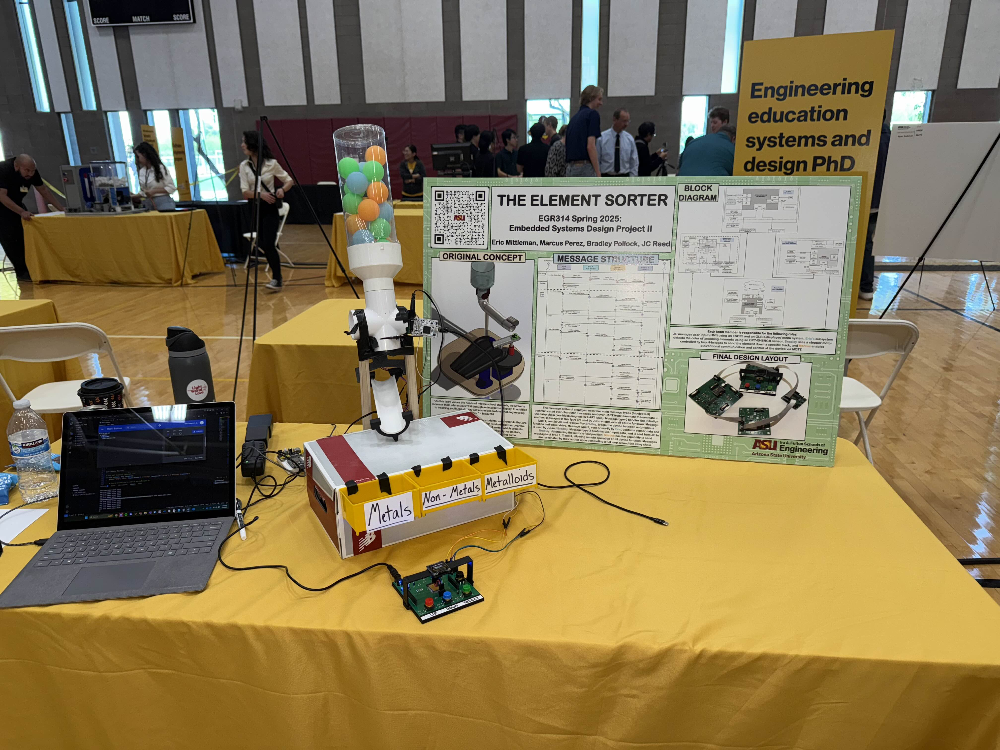
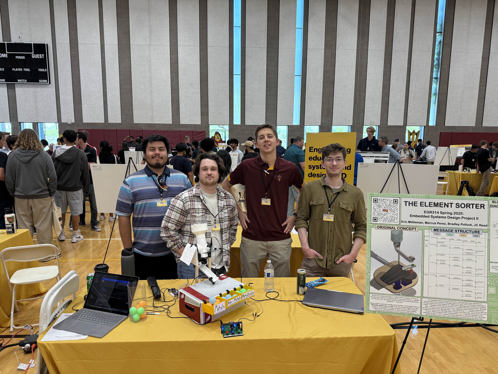
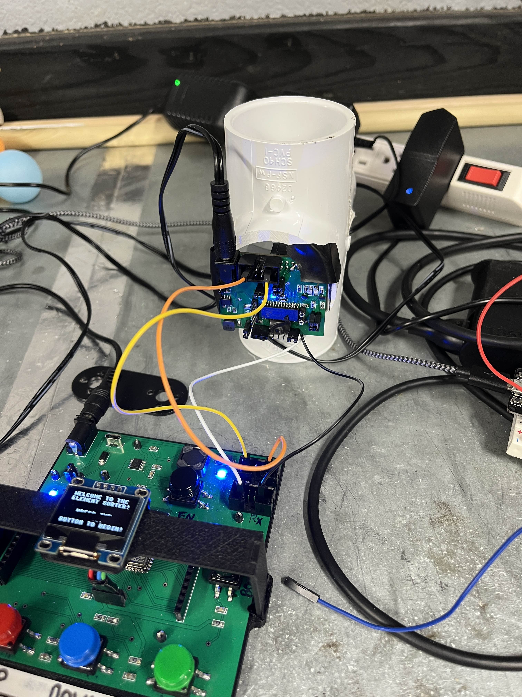
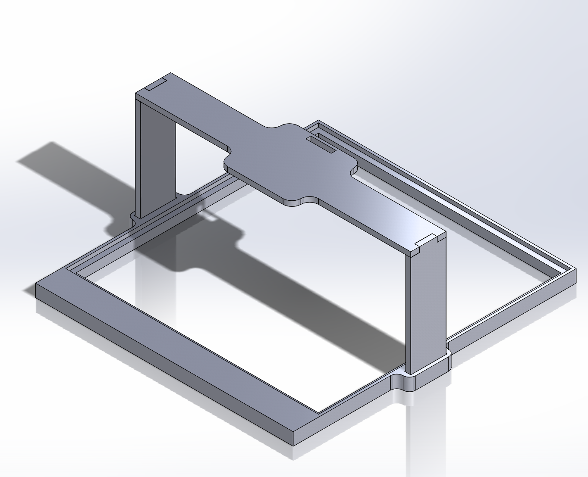
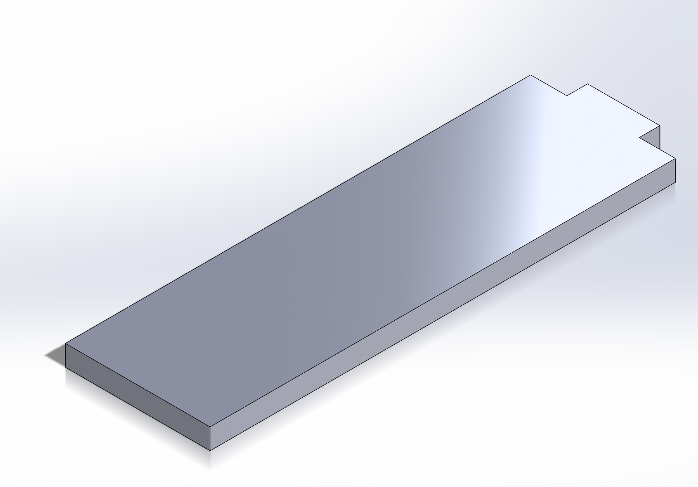
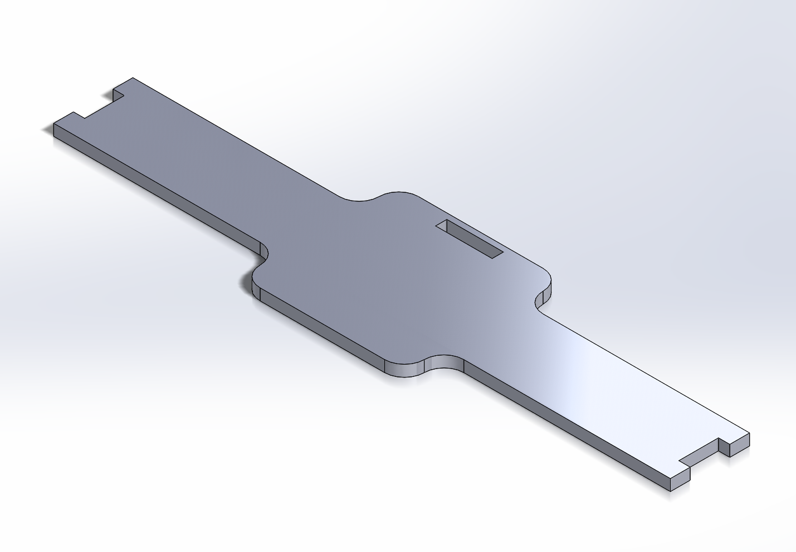
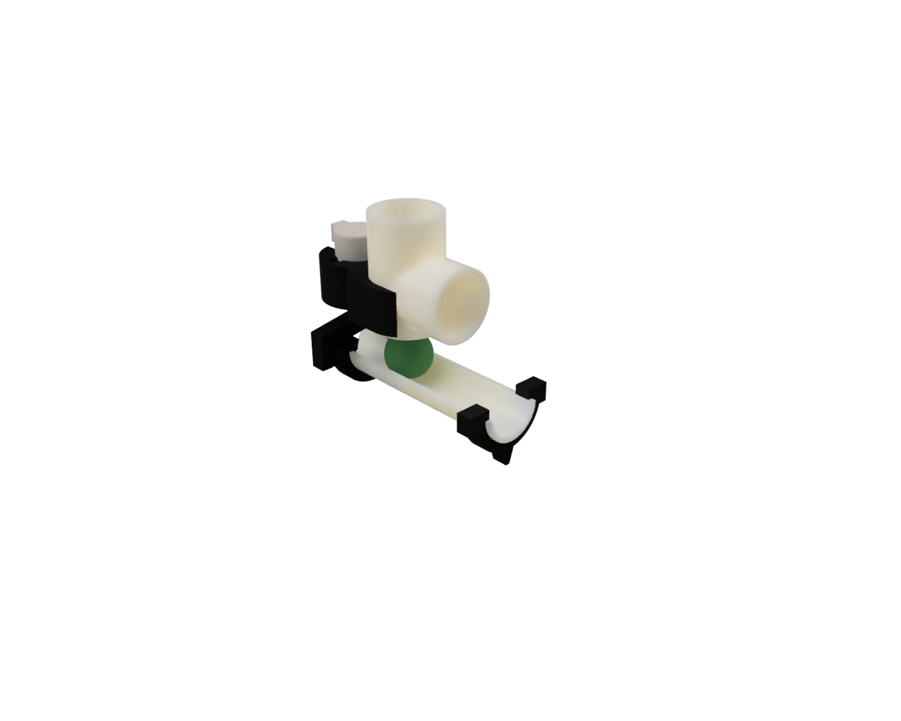

## **Image Gallery**
|  |  |
|-----------------------------------------|---------------------------------------------|
|  |  |
|  |

## **CAD Models Used**

### **HMI Stand and Board Mount CAD Models**
|   
 **PCB Mount** 
 |    
 **Full HMI Display** 
|
|----------|--------|
|   
 **Mounting Arm** 
 |    
**OLED Mount** 
|

### **Actuator Hardware CAD Models**

### **CAD File Downloads**
 - [HMI CAD Models](ZIP/HMI%20-%20CAD%20Files.zip)
 - [Actuator CAD Models](ZIP/Fusion_Team201.zip)
 - [Conceptual CAD Models](ZIP/ConceptCAD.zip)
