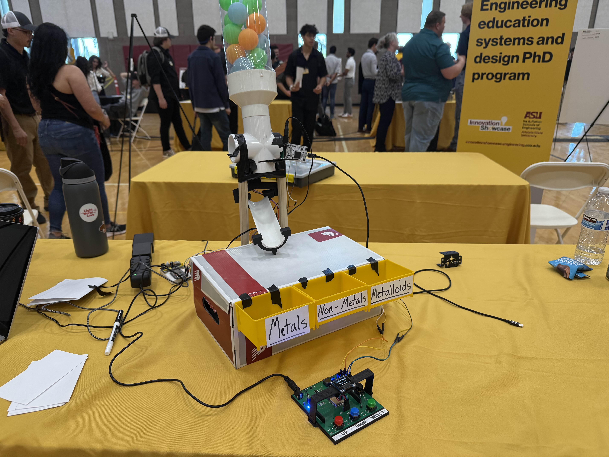

## Team 201 Project: Interactive STEM Exhibit for Students

Welcome to Team 201's exhibit report website! We're excited to share with you what we've been up to. Feel free to meet the team and learn more about our organizational structure below, or jump straight to any point in our design process using the above menu (For mobile users, the menu might be hidden under the &#9776; icon) or the "Our Assignments" table seen below. Again, welcome!

## Introduction (Project Description)
EGR 314 challenges teams to create an interactive S.T.E.M. exhibit to teach K-12 students about a topic of the teams’ choosing — Team 201 tests middle-schoolers’ periodic table knowledge with the Element Sorter — a gamified, colorblind-friendly sorting machine that differentiates between a total of twenty-four metals, nonmetals, and metalloids. The device prompts users to sort the displayed elements into various bins representing the aforementioned categories using an interactive selection interface. The device also features an RGB color sensor and a wireless server to function autonomously (after a brief period of inactivity) or over an internet connection as desired.

**Final Produt Design**

**Team Members:**

| **Team Member** | **Individual Datasheet Link** |
| --- | ----|
| Bradley Pollock | [bradpollock.github.io](https://bradpollock.github.io/){:target=”_blank”} |
| Eric Mittleman |[e-mittl.github.io](https://e-mittl.github.io){:target=”_blank”} |
| JC Reed | [jcmreed.github.io](https://jcmreed.github.io){:target=”_blank”} |
| Marcus Perez | [mpere117.github.io](https://mpere117.github.io/mpere11701.github.io){:target=”_blank”} |

## __Our Assignments__

| Assignment | Link |
|------------|------|
| Team Organization | [link](https://asu-egr314-2025-s-201.github.io/02-TeamOrganization/){:target="_blank"}|
| Ideation and Concept Generation | [link](https://asu-egr314-2025-s-201.github.io/03-IdeationAndConceptGeneration/){:target="_blank"}|
| Block Diagram, Process Diagram, and Message Structure | [link](https://asu-egr314-2025-s-201.github.io/04-Block%20Diagram%2C%20Process%20Diagram%2C%20and%20Message%20Structure/){:target="_blank"} |
| Innovation Showcase Poster | [link](https://asu-egr314-2025-s-201.github.io/05-Poster/){:target="_blank"} | 
| Reflection | [link](https://asu-egr314-2025-s-201.github.io/06-Reflection/){:target="_blank"} |
| Resources | [link](https://asu-egr314-2025-s-201.github.io/07-Resources/){:target="_blank"} |

***Feedback?*** - We appreciate any feedback on our project or site! The team recorder is available at *bradpollock123@gmail.com*.

**Preparation Date:** January 13, 2025

- EGR314 (13574)  -  Spring 2025
- Arizona State University (Polytechnic Campus)  -  Professor Dan Aukes

